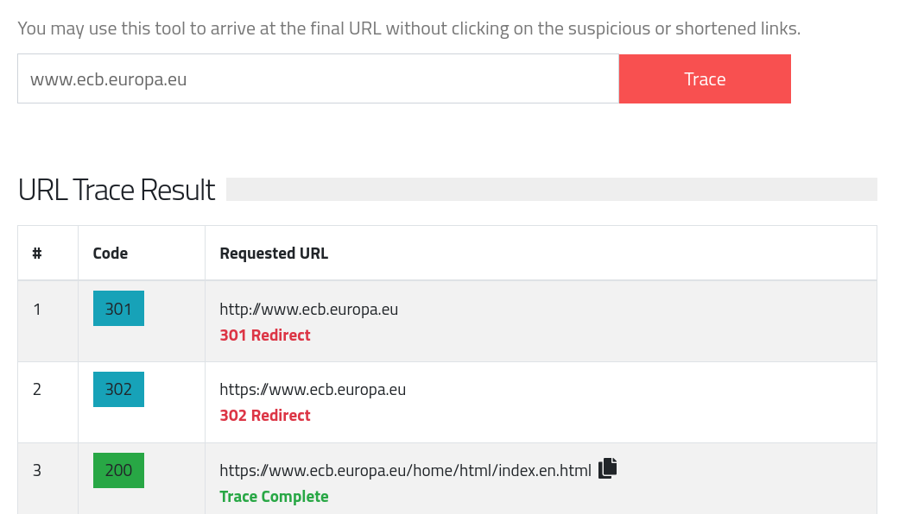
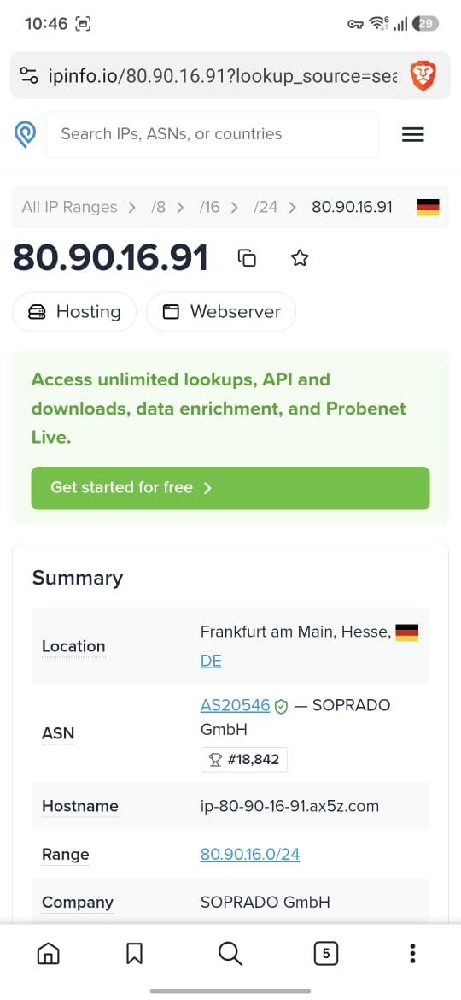

# Baseline Network Analysis: Tracing Unexpected KDE Plasma Connections to the European Central Bank

**Author:** Sachin Kali
**Date:** June 2026
**Category:** Linux Security | Network Analysis | Threat Hunting
**Difficulty:** Beginner-Friendly

---

## Abstract

When building a security research environment, establishing a clean network baseline is essential. Before analyzing malware, testing exploits, or investigating suspicious traffic, researchers must first understand what "normal" looks like.

During a routine baseline audit of a freshly installed Kali Linux system, I discovered recurring outbound HTTPS connections to the European Central Bank (ECB). At first glance, the traffic appeared unusual and unexpected for an isolated research workstation.

This writeup documents the investigation process used to identify the source of the traffic, attribute it to a local process, determine its purpose, and eliminate the background network activity to restore a quiet analysis environment.

---

## Introduction

A common mistake when building security labs is assuming that a fresh operating system installation is silent by default.

Modern desktop environments frequently perform automated network operations for updates, search providers, weather services, telemetry, synchronization, and convenience features.

For security research, especially when monitoring for suspicious communications or potential malware activity, these background connections can create noise and complicate analysis.

As part of a routine baseline assessment, I monitored outbound network traffic on a newly configured Kali Linux workstation. During this review, I observed periodic connections to an unexpected destination:

```text
www.ecb.europa.eu
```

The European Central Bank.

At this stage there was no indication of malicious activity, but every unexplained connection deserves investigation.

---

## Initial Discovery

A URL trace revealed the following request sequence:

| Step | Response     | URL                                               |
| ---- | ------------ | ------------------------------------------------- |
| 1    | 301 Redirect | http://www.ecb.europa.eu                          |
| 2    | 302 Redirect | https://www.ecb.europa.eu                         |
| 3    | 200 OK       | https://www.ecb.europa.eu/home/html/index.en.html |

The connection successfully reached the ECB website through standard HTTPS redirects.

### Screenshot Evidence

**URL Redirect Trace**



**Final Destination**


---

## Infrastructure Attribution

To verify the destination, I performed DNS and IP reputation lookups.

### Results

| Item              | Value                      |
| ----------------- | -------------------------- |
| Target IP         | 80.90.16.91                |
| Location          | Frankfurt am Main, Germany |
| ASN               | AS20546                    |
| Hosting Provider  | SOPRADO GmbH               |
| Security Provider | Myra Security GmbH         |

Myra Security is a German cybersecurity company providing content delivery network (CDN) and web application firewall (WAF) services.

The lookup confirmed that the traffic was reaching legitimate infrastructure associated with the European Central Bank.

### Screenshot Evidence

**IP Attribution**



At this point the destination was verified as legitimate, but the source of the connection remained unknown.

---

## Investigation Methodology

The next step was identifying which local process was responsible for the outbound connection.

### Step 1: Monitor Active Connections

Using `ss`, active TCP sessions were reviewed.

```bash
sudo ss -tpn
```

Alternative tools:

```bash
sudo netstat -plant
```

```bash
sudo lsof -i -P -n
```

One active connection stood out:

```text
ESTAB 0 0 192.168.2.163:53122 80.90.16.91:443
users:(("plasmashell",pid=2441,fd=58))
```

The responsible process was identified as:

```text
/usr/bin/plasmashell
```

---

### Step 2: Verify the Process

The associated PID was examined:

```bash
ps -fp 2441
```

Example output:

```text
UID      PID   CMD
user    2441  /usr/bin/plasmashell
```

This ruled out malware and indicated that the traffic originated from the KDE Plasma desktop environment.

---

## Root Cause Analysis

With the process identified, attention shifted toward KDE Plasma features that might generate network requests.

Potential candidates included:

* Search providers
* Weather integrations
* Currency converters
* Online search modules
* Background update services

Further investigation revealed the culprit:

### KRunner Unit Converter

KRunner is KDE Plasma's integrated launcher and search tool.

Among its many plugins is a currency conversion module capable of processing queries such as:

```text
50 USD to EUR
```

To provide accurate exchange rates, the plugin periodically retrieves data from the European Central Bank's public exchange-rate feed.

Specifically, KDE requests data from:

```text
eurofxref-daily.xml
```

published by the ECB.

The "mystery traffic" was therefore legitimate background activity generated by a desktop convenience feature.

---

## Remediation

Although the traffic was benign, it introduced unnecessary noise into a controlled research environment.

To eliminate the background connections:

### Disable the Unit Converter Plugin

1. Open KRunner settings.
2. Navigate to the plugin configuration page.
3. Locate **Unit Converter**.
4. Disable the plugin.

### Restart Plasma

```bash
kquitapp5 plasmashell
kstart5 plasmashell
```

Alternative method:

```bash
systemctl --user restart plasma-plasmashell.service
```

After restarting Plasma and monitoring network traffic again, no further automated ECB connections were observed.

---

## Investigation Summary

| Finding                     | Result                     |
| --------------------------- | -------------------------- |
| Unexpected Traffic Observed | Yes                        |
| Destination                 | ecb.europa.eu              |
| Destination Verified        | Yes                        |
| Responsible Process         | plasmashell                |
| Malware Detected            | No                         |
| Root Cause                  | KDE KRunner Unit Converter |
| Data Exfiltration           | No Evidence                |
| Remediation Applied         | Plugin Disabled            |
| Issue Resolved              | Yes                        |

---

## Key Lessons Learned

### 1. Fresh Systems Are Rarely Silent

Even newly installed operating systems often generate background traffic through desktop integrations and convenience services.

### 2. Every Packet Should Have an Explanation

When building research environments, unexplained network activity should always be investigated, even if it eventually proves harmless.

### 3. Process Attribution Is Critical

Identifying the local process responsible for a connection is often the fastest way to separate legitimate behavior from suspicious activity.

### 4. Baselines Matter

Without first understanding normal network activity, detecting genuinely malicious communications becomes significantly more difficult.

### 5. Convenience Features Create Noise

Desktop search providers, weather widgets, synchronization services, and currency converters can all generate traffic that complicates analysis.

---

## Conclusion

What initially appeared to be suspicious outbound traffic to the European Central Bank turned out to be a legitimate KDE Plasma feature designed to keep currency conversion data current.

While the activity was benign, the investigation highlights an important lesson for security researchers: never assume that a fresh system is quiet.

Establishing a clean baseline before conducting research helps eliminate uncertainty and ensures that future network anomalies can be identified and investigated with confidence.

In security analysis, understanding normal behavior is often just as important as detecting malicious behavior.

---

## Tools Used

* Kali Linux
* KDE Plasma
* ss
* netstat
* lsof
* ps
* DNS/IP Lookup Services
* Browser Developer Tools

---

*All testing and analysis described in this article was conducted on systems owned and controlled by the researcher for educational and research purposes.*
